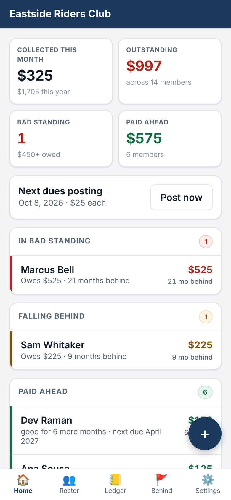
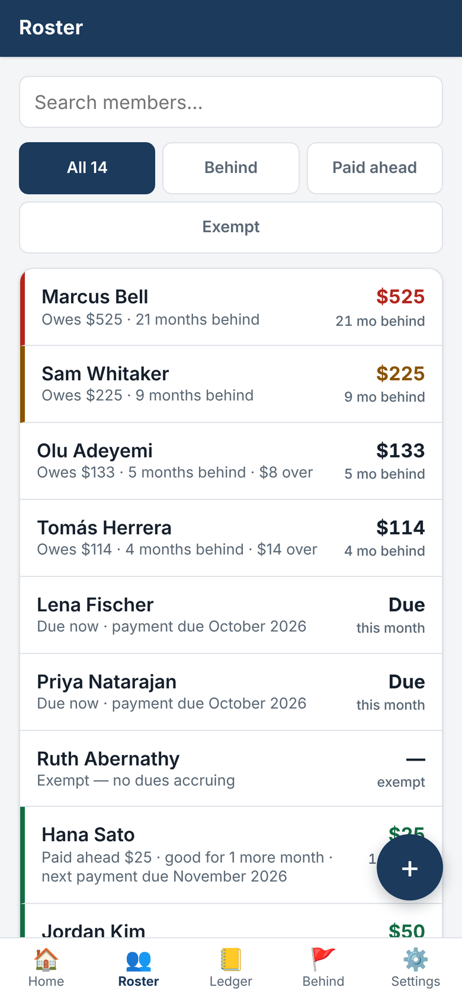
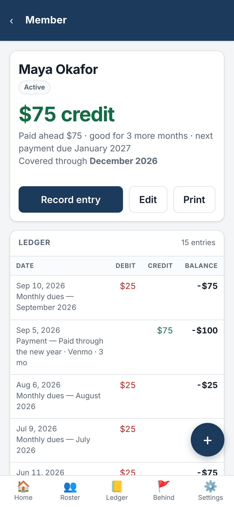
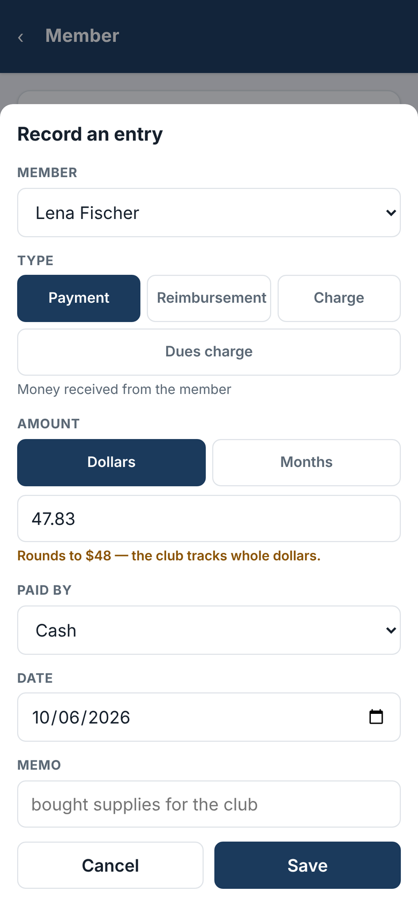
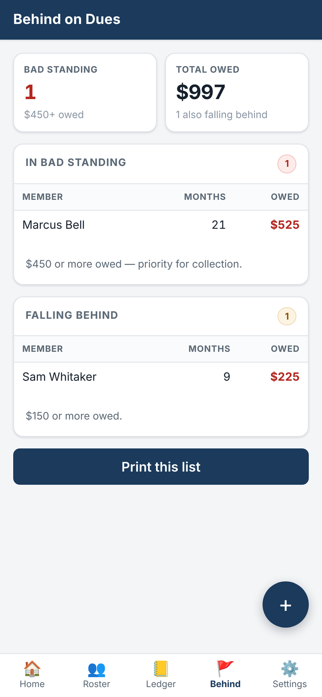
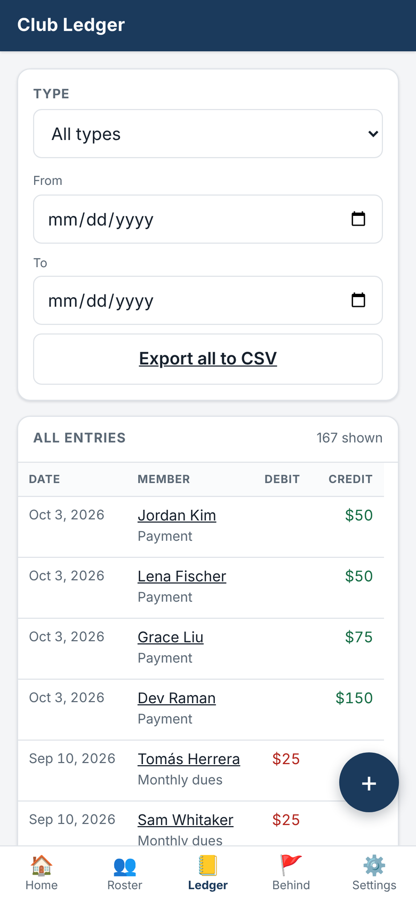
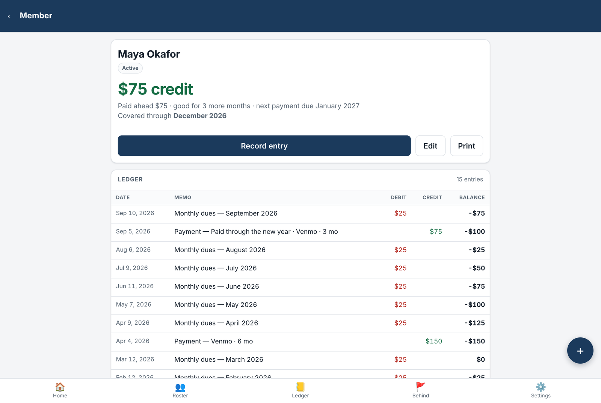

# DuesTracker

**A membership dues ledger for a small club, run by one treasurer from a phone at monthly meetings and from a desktop at home.**

Each member has a traditional two-column debit/credit ledger. Members who pay ahead carry a credit, and members who fall behind carry a balance. Reimbursements for club purchases post as credits against dues. A member's standing (months behind, months prepaid, bad standing) is derived from the balance, never tracked separately.

```
TypeScript · Hono · Preact + Vite · Cloudflare Workers, D1, R2 · Cloudflare Access
103 tests · strict typecheck · ~15 KB gzipped SPA · $0/month on Cloudflare free tiers
```

The full deployment and operations procedure is in **[RUNBOOK.md](RUNBOOK.md)**.

## Screenshots

<table>
  <tr>
    <td></td>
    <td></td>
    <td></td>
  </tr>
  <tr>
    <td align="center"><sub>Dashboard</sub></td>
    <td align="center"><sub>Roster, worst first</sub></td>
    <td align="center"><sub>Member ledger and standing</sub></td>
  </tr>
  <tr>
    <td></td>
    <td></td>
    <td></td>
  </tr>
  <tr>
    <td align="center"><sub>Recording a payment ($47.83 rounds to $48)</sub></td>
    <td align="center"><sub>Delinquency report</sub></td>
    <td align="center"><sub>Club ledger and CSV export</sub></td>
  </tr>
</table>



<sub>Running locally (<code>wrangler dev</code> with local D1) with a fictional club and members seeded through the API at the placeholder rate of $25/month. Phone views at 390 × 844; desktop at 1280 px wide.</sub>

---

## What it does

- **Records payments, dues charges, reimbursement credits and miscellaneous debits** in a few taps on a phone.
- **Posts monthly dues automatically.** A daily cron runs a catch-up job that heals itself after a missed run.
- **Answers the question members actually ask:** *"How many months am I still good for?"* The answer comes in months, plus the month the next payment is due, and it doesn't change when the cron fires.
- **Flags members who are falling behind or in bad standing.** It also produces a printable delinquency report and per-member statements.
- **Exports everything to CSV, and backs itself up weekly to R2.** Point-in-time restore comes from D1 Time Travel.

## Engineering highlights

**The database enforces the rules.** Two invariants carry most of the design:

- **Dues cannot be double-posted.** A partial unique index on `(member_id, period) WHERE kind = 'dues_charge' AND voided_at IS NULL` makes a duplicate charge impossible at the storage layer. The posting job can therefore be a naive "post everything missing" loop that is safe to run at any frequency, concurrently or after a missed cron.
- **Amounts are whole dollars.** `CHECK (amount_cents % 100 = 0)` keeps every balance an exact number of months, so "you're good for 3 more months" is always an exact answer. Entry rounds once and shows the rounded amount before saving (`$47.83 → $48`), so nothing changes silently.

**Balances are computed, never stored.** There is no cached balance column to drift out of sync with the ledger. At club scale the aggregate query is instant. [`docs/DEPLOYMENT.md`](docs/DEPLOYMENT.md) works out how many decades of D1 free-tier headroom that leaves.

**Void and delete mean different things.** Because catch-up posts every missing period, deleting a dues charge just gets it re-posted on the next run. *Voiding* a charge waives that month permanently, while *deleting* one invites a re-post, which is the right fix for a bad import. The difference comes down to a single `WHERE` clause, and tests cover both behaviours.

**Standing doesn't change when the cron runs.** "Months remaining" is counted from the last posted period, not from the calendar. Posting advances the last posted month by one and consumes one month of credit, and the two cancel exactly. A test asserts this across 13 prepayment levels.

**Authentication is checked twice.** Cloudflare Access protects the route. The Worker *also* verifies the Access JWT itself (signature, audience, expiry) on every API request, and there is no `workers.dev` bypass URL. If the route protection ever fails, the app rejects requests instead of serving them. Local dev skips auth only when two conditions both hold: a flag is set *and* the request has no `CF-Ray` header, which every request through Cloudflare's edge carries.

**Tests run against real infrastructure.** The `worker` test project runs inside `workerd` against a real local D1 with the production migrations applied. The `CHECK` constraints and the unique index are under test, not mocked. The posting-date rule is tested against every month from 2024 to 2030.

## Repository layout

```
src/
  index.ts              Worker entry: SPA assets, /api behind Access, cron handler
  middleware/access.ts  Cloudflare Access JWT verification
  routes/api.ts         JSON API (docs/API.md)
  lib/                  period, money, accrual, standing, posting, roster, backup, csv, db
web/                    Preact SPA: dashboard, roster, member ledger, club ledger, delinquency, settings
migrations/             D1 schema
test/unit/              Pure logic in Node
test/worker/            workerd + real local D1 + R2
docs/                   Planning, data model, accrual rules, API, deployment, decisions
RUNBOOK.md              Deploy and operate, end to end
```

## Documentation

| Document | Contents |
|---|---|
| [RUNBOOK.md](RUNBOOK.md) | Local dev, first deployment, Access, crons, backups, restore, updates, troubleshooting |
| [docs/PLANNING.md](docs/PLANNING.md) | The problem, domain rules, screens, scope |
| [docs/DATA-MODEL.md](docs/DATA-MODEL.md) | Schema and why it is shaped that way |
| [docs/ACCRUAL-RULES.md](docs/ACCRUAL-RULES.md) | When dues post; the months-prepaid algorithm |
| [docs/API.md](docs/API.md) | HTTP API reference |
| [docs/DEPLOYMENT.md](docs/DEPLOYMENT.md) | Cloudflare setup and free-tier capacity analysis |
| [docs/DECISIONS.md](docs/DECISIONS.md) | Design decisions with reasoning |

Dollar figures in the docs and tests use a placeholder rate of $25/month. The real rate and thresholds are set in **Settings**.

## Quick start

```bash
nvm use                    # Node 24 LTS, pinned in .nvmrc
npm install
cp .dev.vars.example .dev.vars
npm run db:migrate:local
npm run dev                # Worker API on :8787, Vite SPA on :5173 with /api proxied
npm test && npm run typecheck
```

## License

Code is released under the [MIT License](LICENSE). Documentation is released under [CC BY 4.0](LICENSE-docs.md).
